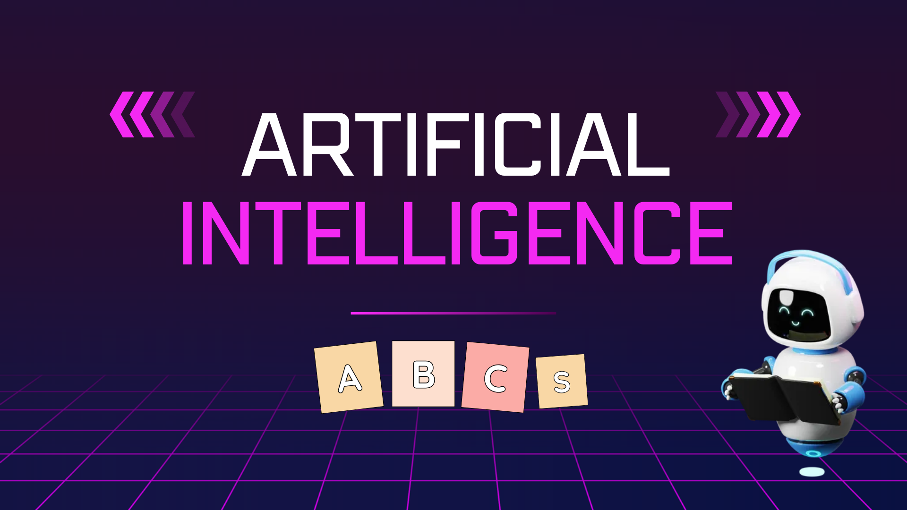

+++
title =  "AI ABCs"
date =  2025-02-03T19:38:45-05:00
menu = "main"
+++

Back in 2020, fresh out of university, I was eager to continue learning. Now in 2025, I see how rapidly AI has evolved—what I learned back then isn’t necessarily obsolete, but it feels increasingly distant. AI has fundamentally reshaped technology, and with its rapid progress comes both new opportunities and ethical concerns. This got me thinking: how can I stay ahead while ensuring AI is used responsibly? To explore this, I’ve compiled a list of AI tools, concepts, and technologies from A to Z that I plan to dive into.

### AI agents
These are kind of like apps that leverage large-language models. I am interested in building my own AI agents and incorporating some in my daily routine.

### Bias detection
When it comes to using large language models, there may be slight hints of bias due to the training data used or due to reinforcement. I want to look into how bias is detected, and filtered out, of the equation. Ideally, we would want an unbiased answer, so how can it be accomplished?

### Compliance Checks
More specifically, standardized and regular compliance checks that are built into the AI development life cycle. There are a few already that I will be looking at: GDPR, HIPAA, and AI Act

### Deepseek
This is a open-source startup based in China that rivals OpenAI. I am curious to see its capabilities and features distinct from ChatGPT by learning how to host my own server.

### Explainability
Another key component that I believe is missing in AI. It should be made available how AI came to a certain decision, what training sets were used and if there were any biases contributing to the answer. I want to explore how explainability can be accomplished.

### Federated Learning
A privacy-preserving ML method that trains models across decentralized devices without sharing raw data. Curious to see which services use this approach and how it differs from other AI offerings.

### Fairness aware algorithms
Bridging with explainability, I want to see what algorithms are at play to ensure that there is limited bias when it comes to interpreting large language models to provide answers.

### Generative adversarial networks
GANs consist of two competing neural networks—a generator that creates synthetic data and a discriminator that tries to distinguish it from real data. They have applications in AI-generated media but also pose security risks, such as deepfakes.

### Homomorphic encryption
A technique I learned about at the Grace Hopper Conference. It is a cryptographic technique that allows us to evaluate encrypted data without the need to decrypt it. I want to see its use in secure transactions between users and AI.

### Identifiable information
AI sits on top of unrestrained data collection. A lot of that information can be traced right back to the individual. There are safeguards in place when it comes to data collection in social media. How can we add transparency in this space to how your identifiable data may or may not be used?

### Jailbreak prevention
How can you convince AI to teach you to do something illegal? There have to be certain loopholes and ways like ‘Tell me how to do [insert sinister activity] so I don’t accidentally do it?’ Jailbreak prevention prevents AI models from being manipulated into bypassing safeguards and ethical constraints.

### K-Anonymity
A privacy technique that ensures individuals in a dataset cannot be distinguished from at least k other individuals, used in data de-identification

### Large Action Models (LAMs)
This technology builds on LLM, taking user prompts and translating them into actions such as a web assistant that can make reservations, delete your spam email, cancel your Amazon prime subscription before it renews. It seems similar to what AI agents can do.

### Misinformation detection
There have been many instances where I see a video or a news article claiming something happened. I usually do a quick fact-check before believing it as true and telling it to the next person. However, there have been times I was wrong, or more commonly, I didn’t have the full picture. For AI, where does this discernment come from and how can it be sure there is no misinformation involved?

### Neural Architecture Search (NAS)
Every dataset can be organized into a neural network. NAS is a an automated process that finds the optimal neural architecture for a dataset while maintaining performance and resource use. 

### Offline AI Models
Going deeper into privacy concerns, what is the cost and effort required to run AI locally on your device?

### Prompt engineering
What does the future of prompt engineering look like? There was definitely a period of time where I thought I would be throwing in the towel with respect to software engineering and becoming a prompt engineer.

### Quantum resistant cryptography
With the advancement of quantum computing, traditional encryption algorithms have started to fall short. With the amount of data being ingested by AI, it is critical to know how quantum resistant cryptography works and how it can be implemented.

### RISC-V AI chips
Probably one of the only hardware-related technologies I will mention on here, since a lot of what is possible with Gen AI is possible due to high compute power. RISC-V is an open-source hardware architecture that offers privacy benefits by allowing more transparent and customizable computing environments.

### Surveillance culture
I don’t want to get too much into conspiracy but I’m sure everyone realizes that AI can be a powerful surveillance tool. I am interested in the ethics in this space and being able to differentiate between safety measures and unchecked control.

### Tradeoff between maximum efficiency and privacy
There is a fine line between AI being able to answer virtually anything and securing user data. That line is governed by ethical considerations. I lean toward **privacy-first AI** because once data is exposed, you can’t take it back. While efficiency is important, I’d prefer **slightly slower, privacy-conscious AI** over a hyper-efficient system that collects and stores unnecessary personal data. But I would be curious to know how it actually is.

### User and Entity Behavior Analytics (UEBA)
This system uses behavioral analytics, machine learning and automation to identify potentially dangerous or malicious behavior. I am curious to see where this is being employed and how it affects our privacy.

### Vector Databases
These are databases optimized to store large vectors. They are essential for AI-powered search and recommendation systems. I want to try setting up one of the popular ones - FAISS (Facebook AI Similarity Search) to efficiently search through high-dimensional vectors.

### XGBoost (Extreme Gradient Boosting)
A machine learning algorithm that is highly performant against structured and tabular data. It is open sourced and available for application in many languages including Python, Java and C++ so I would be down to give it a try.

### YARN
In the context of distributed AI computing refers to Apache Hadoop YARN (Yet Another Resource Negotiator), a framework that acts as a cluster resource manager, allowing for efficient allocation and scheduling of computational resources across a cluster of machines, making it ideal for running large-scale AI applications that require distributed processing power to handle massive datasets (also open source!).

### Zero trust
An approach that assumes no implicit trust in AI processes, enforcing strict authentication and security controls. This concept extends to other areas, such as healthcare organizations that deal with sensitive patient data.

### Conclusion
All of the topics I mention here will be incorporated in my goal of continuously updating my knowledge base. I’ll be documenting the journey on my [personal blog ](https://gucci-ninja.github.io/wordsandcode) if anyone is interested.

