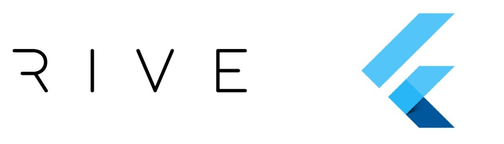
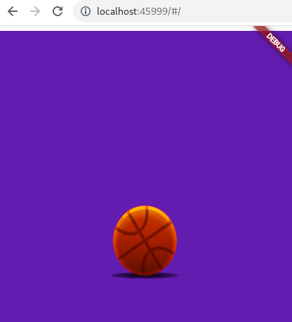
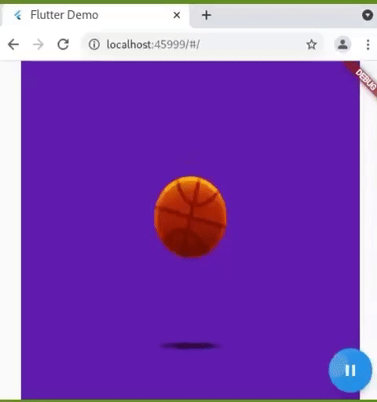

+++
title =  "Flutter Web and Rive Animation Tutorial"
date =  2022-05-31T23:21:27-04:00
menu = "main"
+++



Here is a beginner to intermediate tutorial for setting up a Flutter web app with Rive animations. I recently built a [sliding tile game](https://waterslide-kyy1knexs-gucci-ninja.vercel.app/#/) that incorporates Rive animations for the Flutter Hackathon. In this tutorial I’m going to show you how to add an animation to your Flutter web app and control it through user input.

We will create a basketball animation that will get triggered each time the user clicks on a button.

First we’ll create the animation. If you already have your animation you can skip to this section which will show you how to add your animation to a web app.

Rive is a free-to-use platform for designing and creating animations. We are going to use a basketball animation that Rive provides as one of their tutorials. [Here is the animation.](https://editor.rive.app/preview/642-1469-basketball/219454)

When you open it, there’s a Design tab that let’s you modify the look of the animation, like the colours and original shape of the ball.


If you switch to the Animate tab you can see the animation run. Each animation can have multiple ‘states’, in this one there’s an `idle` state but you could add more, like a `rolling` state or whatever you might need for your business logic.


Download the animation in the newest runtime as `basketball.riv`. Once we hook it up to Flutter, we will be able to play the `idle` animation when the user performs some action, such as clicking a button.

Create a flutter project that we will be adding the animation to. Once the project is created, make an `assets` folder if it doesn't already exist and move your animation file into it. I saved mine under `assets/animations/`.

```
flutter create fluttertutorial
cd fluttertutorial
flutter run -d chrome
```

It will spin up a demo app for you that looks something like this.


Next we add the library that is going to help us control (play and pause) our animation.

Add to `pubspec.yaml` and run `flutter pub get`.

```yaml
dependencies:
	rive: ^0.8.4
```

Then in `lib/main.dart`, import the package.

```dart
import 'package:rive/rive.dart';
```

Now let’s add the animation to our app by creating a stateless widget. Add this code to the end of `lib/main.dart`

```dart
class BasketBallAnimation extends StatelessWidget {
  const BasketBallAnimation({Key? key}) : super(key: key);

  @override
  Widget build(BuildContext context) {
    return const Scaffold(
      body: Center(child: RiveAnimation.asset('animations/basketball.riv')),
    );
  }
}
```

To display this class, find the main class, `MyApp` and set `home:` to point to our new widget.

```dart
class MyApp extends StatelessWidget {
  const MyApp({Key? key}) : super(key: key);

  @override
  Widget build(BuildContext context) {
    return MaterialApp(
      title: 'Flutter Demo',
      theme: ThemeData(
        primarySwatch: Colors.blue,
      ),
      home: const BasketBallAnimation(), // make this change
    );
  }
}
```

Now when you re-run, you should see the basketball animation playing.



Now let’s give the widget state - this is how we will be able to tell if it’s playing or paused.

```dart
class BasketBallAnimation extends StatefulWidget {
  const BasketBallAnimation({Key? key}) : super(key: key);

  @override
  State<BasketBallAnimation> createState() => _BasketBallAnimationState();
}

class _BasketBallAnimationState extends State<BasketBallAnimation> {
  bool isPlaying = false;
  
  @override
  Widget build(BuildContext context) {
    return Scaffold(
      body: const Center(child: RiveAnimation.asset('animations/basketball.riv')),
    );
  }
}
```

Next we will add a button that, when called, will change the value of `isPlaying`

```dart
class _BasketBallAnimationState extends State<BasketBallAnimation> {
  bool isPlaying = false;

	void _toggleAnimation() {
    setState(() {
      isPlaying = !isPlaying;
    });
  }

	@override
  Widget build(BuildContext context) {
    return Scaffold(
      body:
          const Center(child: RiveAnimation.asset('animations/basketball.riv')),
			floatingActionButton: FloatingActionButton(
        onPressed: _toggleAnimation,
        tooltip: isPlaying ? 'Pause' : 'Play',
        child: Icon(
          isPlaying ? Icons.pause : Icons.play_arrow,
        ),
      ),
  }
}
```

Finally, we can hook up the RiveController methods. The `RiveAnimationController` is what holds the state of our animation. Initially, we are going to set it to play our animation named `idle`. This is a `SimpleAnimation`. We will be able to tell if the animation is playing or not by checking the `isActive` property of the controller. We attach this controller to our animation asset by passing it into our animation.

```dart
RiveAnimation.asset('path/to/my/animation.riv', controllers: [_controller])
```

Here is the updated code with the controller hooked up.

```dart
class _BasketBallAnimationState extends State<BasketBallAnimation> {
  late RiveAnimationController _controller;

  bool get isPlaying => _controller.isActive;

  void _toggleAnimation() {
    setState(() {
      _controller.isActive = !_controller.isActive;
    });
  }

  @override
  void initState() {
    super.initState();
    _controller = SimpleAnimation('idle');
  }

  @override
  Widget build(BuildContext context) {
    return Scaffold(
      body: Center(
          child: RiveAnimation.asset('animations/basketball.riv',
              controllers: [_controller])),
      floatingActionButton: FloatingActionButton(
        onPressed: _toggleAnimation,
        tooltip: isPlaying ? 'Pause' : 'Play',
        child: Icon(
          isPlaying ? Icons.pause : Icons.play_arrow,
        ),
      ),
    );
  }
}
```

Now you should have something that looks like the screen below. A basketball animation that starts and stops when the user interacts with the floating button.



Hope this tutorial helps you. The complete code for `lib/main.dart` can be found in [this gist](https://gist.github.com/gucci-ninja/4698166233ab078a2ff979b45a4673bb). Happy coding :)