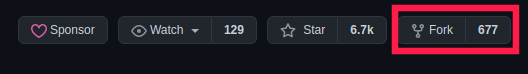

+++
title =  "How to start contributing to open source"
date =  2021-01-18T02:14:58-04:00
menu = "main"
+++

Hi everyone! Recently I made my first open source contribution and wanted to share my experience as well as any tips I have for developers getting into open source development.

### Step 1 — Finding motivation
Due to COVID-19, I realized how much we rely on technology to bring people together. Then I thought about how much of that tech is made possible due to open source. I feel so grateful that I have access to and the potential to contribute to all this tech. So I wanted to give back to the open source community. I also wanted to be part of a community since I was feeling more disconnected while staying at home all the time. Being motivated was a key part in achieving my goal.

### Step 2 — Where to start
Once I knew I wanted to make open source contributions, I realized that I had no idea where to find opportunities. It felt like every project out there already had a select group of people working on it. I felt like they didn’t need me. After overcoming these doubts, I found [this repo on Github](https://github.com/MunGell/awesome-for-beginners), which has a bunch of first PR opportunities separated by language. It was really helpful because I was able to find projects that align with my skillset.

### Step 3 — Choosing a project
As a general rule of thumb, I only look at repos that have open issues with a ‘good first issue’ tag or something similar. Then, I check the dates of those open issues. If they are older than a month, chances are that development on that project is pretty slow and you might have to wait a while to get assigned. For my first contribution, I decided to go with a very active project called [chatwoot](https://github.com/chatwoot/chatwoot), written in Ruby on Rails and Vue — both of which I have experience with.

### Step 4 — Getting your first issue
Once you find an issue with a ‘beginner-friendly’ tag, drop a comment saying you’d like to work on it! If it’s a fairly active repo, you’ll get assigned within a day. Make sure you don’t take on an issue someone is already assigned to!

### Step 5 — Installation and setup
Once you know what you’re working on, you have to fork the repository.

After that, clone the the forked copy onto your machine.

`git clone https://github.com/your-username/open-source-repo.git`

Then comes the hardest part, installing dependencies and getting the project to build! A lot of repos that encourage open source contributions have immaculate documentation on how to build and deploy locally, so it’s not THAT bad. But sometimes there are issues due to versions, operating systems, etc that make it painful. This is why it is a good idea to start off with a project that uses a stack you’re familiar with!

### Step 6 — Code!
This is the fun part! Read the open issue carefully to make sure you don’t miss anything. And don’t be afraid to ask for help! I was surprised at how nice everyone was. Then it occurred to me that they were probably in my shoes once. Create a new branch off of main/development and name it according to convention. If there is no convention then I usually do `#ISSUE_NUMBER-description`, for example, `1234-add-error-handling-to-users-page`.

### Step 7 — Making that PR
This is the final step of the process and it can be a little tricky so I’ve tried to make this section a little more informative.
1. If there is a test suite, run it to make sure your code won’t break anything. If there isn’t, still thoroughly test your changes
2. Add an upstream url, this will help you stay up to date with changes on the original repo. `git remote add upstream https://github.com/open-source-project-repo.git`
3. Make sure your copy is up to date with the original repository by doing `git pull upstream` followed by `git rebase <active-branch>` on your branch
4. Push your tested and updated code up to Github and go to the original repository to make a pull request.

5. Here you will see a form where you fill out a title as well as description for your PR. Usually if it’s a UI change I will add pictures to show a before and after. Make sure you are making a PR for the right branches. And don’t forget to link the issue number somewhere so people know that your PR is resolving that issue.
6. Submit the PR and wait for people to review!
Those are all the steps you need to get your first open source contribution. I also have a few tips that may be helpful along the way.

### Tip #1 : Don’t be intimidated!
Like I said, even though I had the motivation, I didn’t feel like my work was needed. In fact, I actually felt like my code was not good enough, which lead me to believe that even if I did make a PR with my code, it would get rejected. This is not true! The open source community is very welcoming to beginners! They are also very helpful.

### Tip #2 : Follow the standard
An open source project is hard to maintain and a lot of people are needed to make it work. That’s why it’s important to look at the coding style of the project as well as any specific guidelines you may need to follow in your code. If they are using a specific style guide like [rubystyle.guide](https://rubystyle.guide/), make sure your code follows it! That will make it easier for everyone to work with your code.

### Tip #3 : Be open to criticism
It’s hard to contribute to a project you are just getting started with. There are people who may have been working on it for years. Once you make your PR, you will get comments on it. Be ready to engage in some discussion with your reviewers :)

I hope my experience helps someone get into open source.

Thanks for reading!